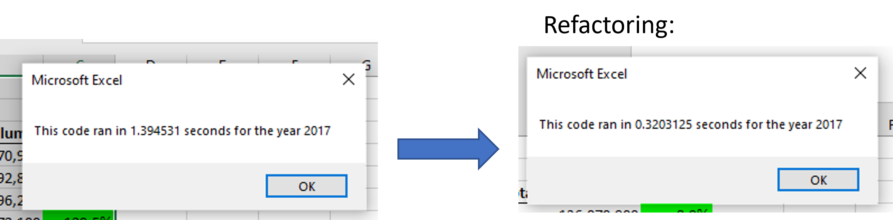
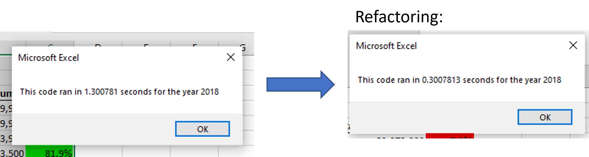

# Stock-Analysis-Challenge
Challenge Module 2. Data Analytics TEC Bootcamp

**Note: Please check in the file the tab "All Stocks AnalysisCHALLENGE". That´s where I displayed the task for this Challenge. The other tabs are what I worked through the Module 2.**

## Overview of the project
The idea is to help Steve get fast information in stock prices for his parents to know information about the whole stock markets that includes volumen traded and returns.

## Results
Even though we had already worked in getting the results, we wanted to do it in an efficient way; while we keep getting more and more data from the stocks in the market, we´ll need to think about scalable processess and therefore we need to consider refactoring the code. In this ocassion, we manage to change the execution time from above 1 second to around 0.3 seconds, which is more than 3 times faster. Here are the examples of the time we manage to reduce for running the code with the same answers: 

and:

We were able to do this by putting variables within variables instead of managing data separately. An example for the lines of codes that where refactored is the following.

This is how it was at the beginning: *totalVolume = totalVolume + Cells(j, 8).Value*

This is how we improve it: *tickerVolumes(tickerIndex) = tickerVolumes(tickerIndex) + Cells(j, 8).Value*

    We can see that by putting the index within the volume calculation made it faster to run. Of course this means that other changes were needed in the code to be able to adapt this line.

I also did a checking of lines of codes that could be repetitive and weren´t adding something so that after deleting them, the code spend less time running.

## Summary

Giving us the time to refactor code once we have managed to make it work is also an important step of the work. This means we are taking the time to clean our data and get rid as much as possible of technical debt. This will help us build better code on top of it without ruining something, it will be easier to understand for someone else and while all this makes it more efficient you will also become more competitive in the market because you will be able to provide results in less time (consuming less resources) than the competition. The con I see is that it means more sophisticated code and only people that know more about coding will be able to follow the refactor way of coding sometimes. Also I see it´s time consuming; in real life if you are making something work it´s good enough so you can go to the next problem to solve.

Specifically talking about this exercise, we were able to report a delta in time reduction for execution for about 77% to 80%. That means we are being more efficient. There are so many companies nowadays offering great prices to people that are able to make their processess more effcient that it´s really worth always considering this. Even though we had an improvement, in this code it was marginal; it went from seconds to less than 1. If the difference won´t be much is better to focus time and resources in the next problem that could generate more impact and value to the company.
